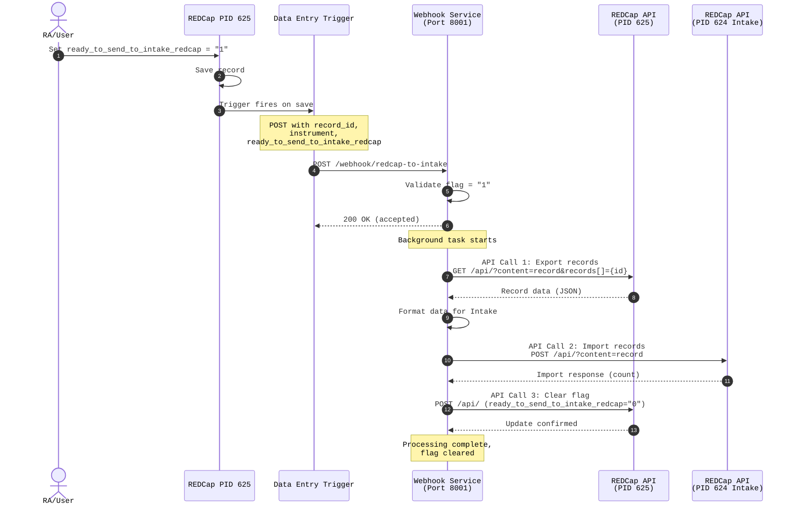
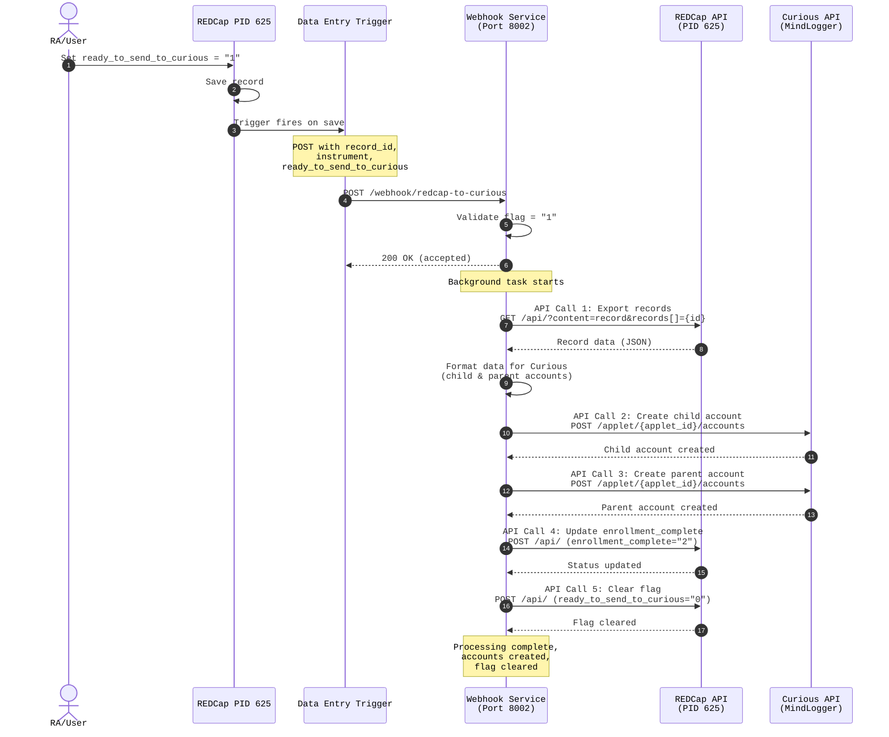

# HBN Migration Infrastructure

Terraform configuration for deploying HBN Migration webhook services on EC2.

## Architecture

The system uses REDCap Data Entry Triggers to push data in real-time via webhooks.

Key Features:

- Real-time webhook processing (no polling)
- No caching for REDCap pushes
- Event-driven architecture
- Direct deployment to EC2 (no ALB, minimal CloudWatch)

See WEBHOOK_SETUP.md for detailed architecture diagrams.

## Services Managed

Webhook Services (always running):

- redcap-to-redcap.service (Port 8001): Webhook for pushing to Intake REDCap
- redcap-to-curious.service (Port 8002): Webhook for pushing to Curious/MindLogger

Other Services (existing):

- curious-alerts-websocket.service: WebSocket for Curious alerts
- curious-data-to-redcap.service: Scheduled sync from Curious to REDCap
- ripple-to-redcap.service: Scheduled sync from Ripple to REDCap
- hbn-sync.timer: Timer for scheduled services

## Quick Start

Step 1: Initial Setup

```bash
./setup_terraform.sh
cp terraform.tfvars.example terraform.tfvars
vim terraform.tfvars
terraform init
```

Step 2: Configure Variables

Edit terraform.tfvars:

```tfvars
environment = "production"
vpc_id = "vpc-xxxxx"
subnet_id = "subnet-xxxxx"
ami_id = "ami-xxxxx"
key_name = "your-key-pair"
webhook_allowed_cidrs = ["1.2.3.4/32"]
ssh_allowed_cidrs = ["5.6.7.8/32"]
```

Step 3: Deploy Infrastructure

```bash
terraform plan
./safe-apply.sh
```

Step 4: Configure REDCap Data Entry Triggers

Get webhook URLs:

```bash
terraform output redcap_to_intake_webhook_url
terraform output redcap_to_curious_webhook_url
```

Configure in REDCap:

1. Go to Project Setup > Additional Customizations > Data Entry Trigger
2. Paste the webhook URL from terraform output
3. Test by setting flag to "1" and saving a record

Step 5: Verify Deployment

```bash
ssh -i /path/to/key.pem ubuntu@INSTANCE_IP
sudo systemctl status redcap-to-redcap.service
sudo systemctl status redcap-to-curious.service
curl http://localhost:8001/health
curl http://localhost:8002/health
sudo journalctl -u redcap-to-redcap.service -f
```

## Data Flow





## Configuration

Key terraform.tfvars settings:

- environment: Environment name (dev, staging, production)
- vpc_id: VPC ID for deployment
- subnet_id: Subnet ID for EC2 instance
- ami_id: AMI ID (Ubuntu 22.04 recommended)
- instance_type: EC2 instance type (default: t3.small)
- key_name: SSH key pair name
- webhook_allowed_cidrs: CRITICAL - REDCap server IPs only
- ssh_allowed_cidrs: IPs allowed to SSH
- working_directory: Application directory (default: /opt/hbnmigration)
- service_user: System user (default: hbnmigration)

## Security

Config File Permissions:

Terraform automatically sets secure permissions on config files:

```text
Location: /opt/hbnmigration/python_jobs/src/hbnmigration/_config_variables/
Directories: 750 (rwxr-x---)
Config files: 640 (rw-r-----)
Owner: hbnmigration:hbnmigration
```

Only the service user can read credential files.

Network Security:

- Webhook ports (8001, 8002) restricted to REDCap server IPs
- SSH restricted to specified CIDR blocks
- All other inbound traffic blocked

## Workspaces

Terraform workspaces allow isolated testing environments.

Available Workspaces:

- default: Production environment
- test: Testing environment (create as needed)

Workspace Commands:

```bash
terraform workspace new test
terraform workspace list
terraform workspace select test
terraform workspace select default
terraform apply
```

Workspace Isolation:

Each workspace maintains:

- Separate Terraform state files
- Separate EC2 instances
- Different public IPs (different webhook URLs)
- Isolated deployments

Testing Workflow:

```bash
terraform workspace new test
terraform apply
terraform output redcap_to_intake_webhook_url
# Test with non-production REDCap
terraform workspace select default
terraform apply
```

## State Management

Automatic Backups:

State backups run before each apply:

- Location: infrastructure/backups/
- Retention: 30 timestamped backups
- Trigger: Automatic via safe-apply.sh
- Manual backup: ./backup-state.sh

Restore from Backup:

```bash
ls -lh backups/
terraform workspace select default
cp backups/terraform.tfstate.YYYYMMDD-HHMMSS terraform.tfstate
terraform state list
```

## Monitoring Services

Check Service Status:

```bash
sudo systemctl status redcap-to-redcap.service
sudo systemctl status redcap-to-curious.service
sudo systemctl status curious-alerts-websocket.service
sudo systemctl status ripple-to-redcap.service
```

View Logs:

```bash
sudo journalctl -u redcap-to-redcap.service -f
sudo journalctl -u redcap-to-curious.service -f
sudo journalctl -u 'redcap-*' -u 'curious-*' -f
tail -f /var/log/hbnmigration/*.log
```

Health Checks:

```bash
curl http://localhost:8001/health
curl http://localhost:8002/health
curl http://INSTANCE_IP:8001/health
curl http://INSTANCE_IP:8002/health
```

## Maintenance

Update Application Code:

```bash
ssh ubuntu@INSTANCE_IP
cd /opt/hbnmigration
git pull origin main
source venv/bin/activate
pip install -e python_jobs
sudo systemctl restart redcap-to-redcap.service
sudo systemctl restart redcap-to-curious.service
```

Update Service Configuration:

1. Edit service templates in ./services/*.service.tpl
2. Run ./safe-apply.sh
3. Services are automatically restarted

Update Terraform Configuration:

1. Edit variables in terraform.tfvars
2. Run terraform plan to preview
3. Run ./safe-apply.sh to apply

## Troubleshooting

Webhook Not Receiving Requests:

```bash
terraform output redcap_to_intake_webhook_url
terraform show | grep webhook_allowed_cidrs
curl -X POST http://INSTANCE_IP:8001/webhook/redcap-to-intake -d "record=TEST&ready_to_send_to_intake_redcap=1"
sudo systemctl status redcap-to-redcap.service
sudo journalctl -u redcap-to-redcap.service -n 100
```

Records Not Being Processed:

```bash
sudo journalctl -u redcap-to-redcap.service | grep "record"
sudo journalctl -u redcap-to-redcap.service | grep ERROR
```

Services Won't Start:

```bash
sudo systemctl status SERVICE_NAME
sudo journalctl -u SERVICE_NAME -n 100
ls -la /opt/hbnmigration
ls -la /var/log/hbnmigration
```

Wrong Workspace Deployed:

```bash
terraform workspace show
terraform state list
terraform workspace select default
```

Config File Permissions Issues:

```bash
ls -la /opt/hbnmigration/python_jobs/src/hbnmigration/_config_variables/
sudo chown -R hbnmigration:hbnmigration /opt/hbnmigration/python_jobs/src/hbnmigration/_config_variables/
sudo chmod 750 /opt/hbnmigration/python_jobs/src/hbnmigration/_config_variables/
sudo find /opt/hbnmigration/python_jobs/src/hbnmigration/_config_variables/ -type f -name "*.py" -exec chmod 640 {} \;
```

## Cleaning Up Workspaces

To remove a test workspace:

```bash
terraform workspace select test
terraform destroy
terraform workspace select default
terraform workspace delete test
rm -rf terraform.tfstate.d/test
```

## Cost Estimate

Monthly costs (approximate):

| Item                    | Monthly Cost |
|-------------------------|-------------:|
| EC2 Instance (t3.small) | ~$15         |
| Data Transfer           | ~$1          |
| **Total**               | **~$16**     |

## Support

For issues or questions:

- Documentation: See WEBHOOK_SETUP.md for architecture details
- [GitHub Issues](https://github.com/childmindresearch/hbnmigration/issues)
- Logs: Always check journalctl first
- Contact: HBN Data Team
