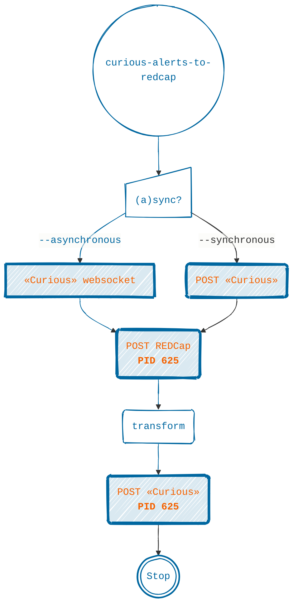
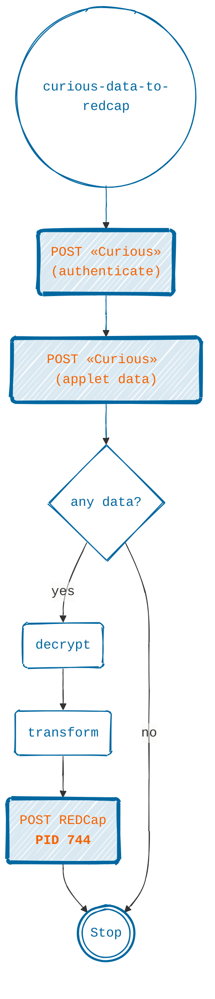
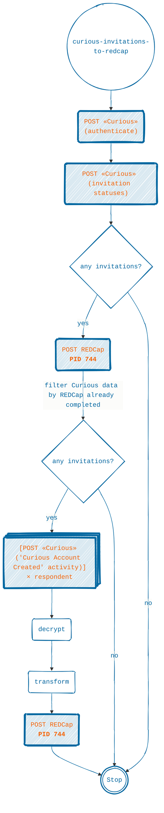

# from Curiuos

## alerts to REDCap

```mermaid
---
config:
  look: handDrawn
  themeVariables:
    edgeLabelBackground: '#FAF9F500'
    fontFamily: "Verdana, Courier New, Arial Black, Arial Bold, cursive, fantasy"
---
flowchart TD
    classDef apiCall color:#F56200,fill:#0067a025,stroke:#0067a0,stroke-width:4px;
    classDef default stroke:#0067a0,color:#0067a0,fill:#FAF9F510;

    start@{ shape: circle, label: "curious-alerts-to-redcap" } --> sync@{ shape: manual-input, label: "(a)sync?"} --"--asynchronous"--> websocket@{ shape: rectangle, label: "«Curious» websocket" } --> _fetch_alerts_metadata --> transform@{ shape: rounded, label: "transform" } --> push_to_redcap@{ shape: rounded, label: "POST «Curious»\n**PID 625**" } --> stop@{ shape: dbl-circ, label: "Stop" };

    sync --"--synchronous"--> fetch_alerts@{ shape: rounded, label: "POST «Curious»" } --> _fetch_alerts_metadata@{ shape: rounded, label: "POST REDCap\n**PID 625**" };

    class fetch_alerts,_fetch_alerts_metadata,push_to_redcap,websocket apiCall;
    linkStyle 0,1,2,3,4 stroke:#0067a0,color:#0067a0
```

## data to REDCap

```mermaid
---
config:
  look: handDrawn
  themeVariables:
    edgeLabelBackground: '#FAF9F500'
    fontFamily: "Verdana, Courier New, Arial Black, Arial Bold, cursive, fantasy"
---
flowchart TD
    classDef apiCall color:#F56200,fill:#0067a025,stroke:#0067a0,stroke-width:4px;
    classDef default stroke:#0067a0,color:#0067a0,fill:#FAF9F510;

    start@{ shape: circle, label: "curious-data-to-redcap" } --> authenticate@{ shape: rounded, label: "POST «Curious»\n(authenticate)" } --> pull@{ shape: rounded, label: "POST «Curious» (applet data)" } --> datacheck@{ shape: diamond, label: "any data?" } --"yes"--> decrypt( decrypt ) --> transfor( transform ) --> pushREDCap@{ shape: rounded, label: "POST REDCap\n**PID 744**" } --> stop

    datacheck --"no"--> stop@{ shape: dbl-circ, label: "Stop" };

    class authenticate,pull,pushREDCap apiCall;
    linkStyle 0,1,2 stroke:#0067a0,color:#0067a0
```

## invitations to REDCap

```mermaid
---
config:
  look: handDrawn
  themeVariables:
    edgeLabelBackground: '#FAF9F500'
    fontFamily: "Verdana, Courier New, Arial Black, Arial Bold, cursive, fantasy"
---
flowchart TD
    classDef apiCall color:#F56200,fill:#0067a025,stroke:#0067a0,stroke-width:4px;
    classDef default stroke:#0067a0,color:#0067a0,fill:#FAF9F510;

    start@{ shape: circle, label: "curious-invitations-to-redcap" }
    authenticate@{ shape: rounded, label: "POST «Curious»\n(authenticate)" }
    pull@{ shape: rounded, label: "POST «Curious» (invitation statuses)" }
    fetchREDCap@{shape: rounded, label: "POST REDCap\n**PID 744**" }
    activityAnswers@{ shape: procs, label: "[POST «Curious» ('Curious Account Created' activity)]\n× respondent" }
    pushREDCap@{shape: rounded, label: "POST REDCap\n**PID 744**" };

    start --> authenticate --> pull --> datacheck0@{ shape: diamond, label: "any invitations?" } --"yes"--> fetchREDCap --"filter Curious data by REDCap already completed"--> datacheck@{ shape: diamond, label: "any invitations?" } --"yes"--> activityAnswers --> decrypt( decrypt ) --> transfor( transform ) --> pushREDCap --> stop;

    datacheck0 --"no"--> stop@{ shape: dbl-circ, label: "Stop" };
    datacheck --"no"--> stop;

    class authenticate,pull,activityAnswers,fetchREDCap,pushREDCap apiCall;
    linkStyle 0,1,2,3,4,5,6,7,8,9,10,11 stroke:#0067a0,color:#0067a0
```
